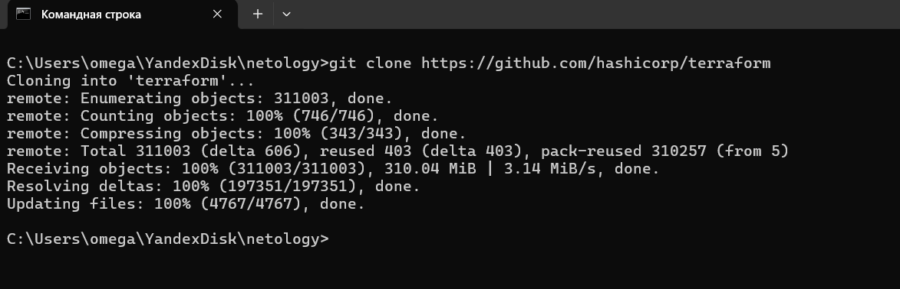
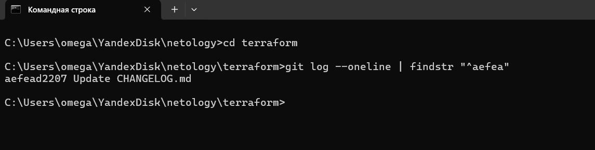
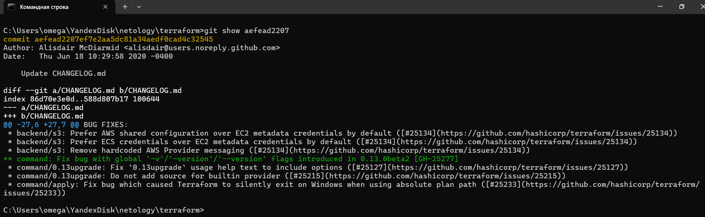
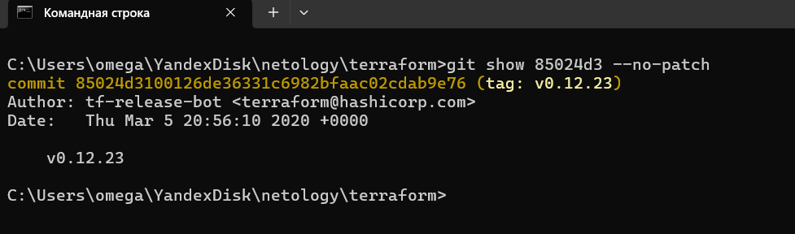
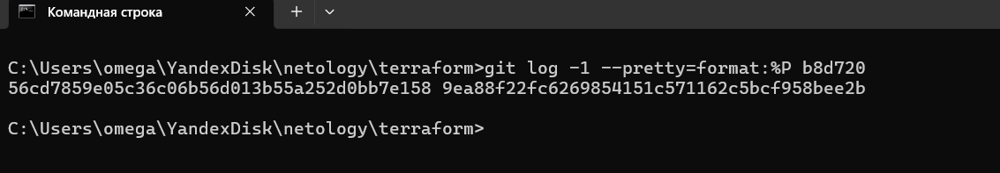
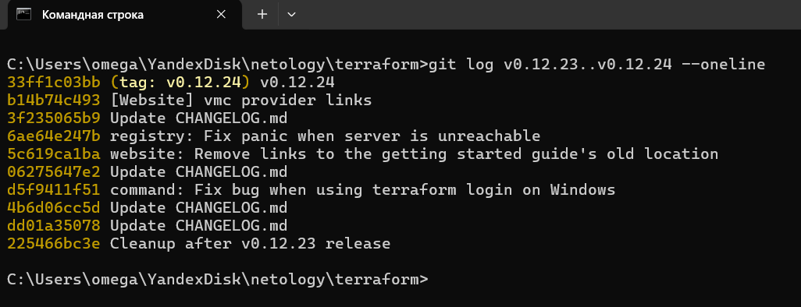
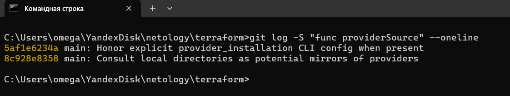
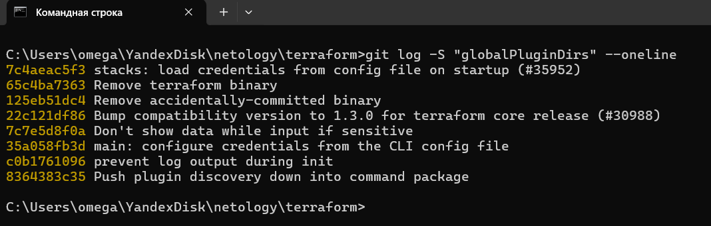

# Домашнее задание к занятию "`Инструменты Git`" - `Дедюрин Денис`

### Клонируем репозиторий


---
## 1. Найдите полный хеш и комментарий коммита, хеш которого начинается на aefea.
### Переходим в директорию клонированного репозитория и выполняем команду:
```
git log --oneline | findstr "^aefea"
```
Где:
```
git log --oneline выводит список коммитов с сокращёнными хешами и комментариями.
findstr "^aefea" фильтрует строки, начинающиеся с aefea.
```


Для получения полного хеша воспользуемся командой:
```
git show aefead2207
```


Вывод будет содержать полную информацию о коммите, включая его полный хеш, автора, дату и изменения, сделанные в этом коммите.

---
## 2. Какому тегу соответствует коммит 85024d3?
### Чтобы узнать какому тегу соответствует коммит 85024d3 выполним команду:
```
git show 85024d3 --no-patch
```

Видим что этому коммиту соответствует тег v0.12.23

---
## 3. Сколько родителей у коммита b8d720? Напишите их хеши.
### Чтобы узнать сколько родителей у коммита b8d720, выполним команду:
```
git log -1 --pretty=format:%P b8d720
```

Хеши родителей:

```
56cd7859e05c36c06b56d013b55a252d0bb7e158
9ea88f22fc6269854151c571162c5bcf958bee2b
```
---
## 4. Перечислите хеши и комментарии всех коммитов, которые были сделаны между тегами v0.12.23 и v0.12.24.
### Для того чтобы перечислить хеши и комментарии всех коммитов, которые были сделаны между тегами v0.12.23 и v0.12.24, выполним команду:
```
git log v0.12.23..v0.12.24 --oneline
```

Результат выполнения:

```
33ff1c03bb (tag: v0.12.24) v0.12.24
b14b74c493 [Website] vmc provider links
3f235065b9 Update CHANGELOG.md
6ae64e247b registry: Fix panic when server is unreachable
5c619ca1ba website: Remove links to the getting started guide's old location
06275647e2 Update CHANGELOG.md
d5f9411f51 command: Fix bug when using terraform login on Windows
4b6d06cc5d Update CHANGELOG.md
dd01a35078 Update CHANGELOG.md
225466bc3e Cleanup after v0.12.23 release
```
## 5. Найдите коммит, в котором была создана функция func providerSource, её определение в коде выглядит так: func providerSource(...) (вместо троеточия перечислены аргументы).
### Чтобы найти коммит, в котором была создана функция func providerSource, выполним команду:
```
git log -S "func providerSource" --oneline
```

Результат выполнения:

```
git log -S "func providerSource" --oneline
5af1e6234a main: Honor explicit provider_installation CLI config when present
8c928e8358 main: Consult local directories as potential mirrors of providers
```

---
## 6. Найдите все коммиты, в которых была изменена функция globalPluginDirs.
### Чтобы найти коммит, в которых была изменена функция globalPluginDirs, выполним команду:
```
git log -S "globalPluginDirs" --oneline
```

```
Результат выполнения:

```
7c4aeac5f3 stacks: load credentials from config file on startup (#35952)
65c4ba7363 Remove terraform binary
125eb51dc4 Remove accidentally-committed binary
22c121df86 Bump compatibility version to 1.3.0 for terraform core release (#30988)
7c7e5d8f0a Don't show data while input if sensitive
35a058fb3d main: configure credentials from the CLI config file
c0b1761096 prevent log output during init
8364383c35 Push plugin discovery down into command package
```
